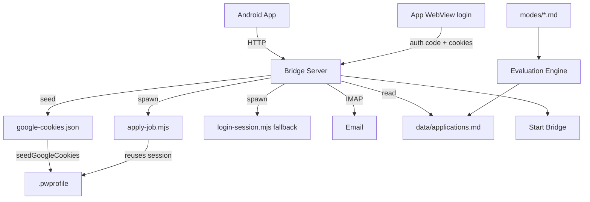

# CareerOps Hub

This is the map of content (MOC) for the career-ops knowledge graph. Everything
ultimately hangs off this note. Use the graph view to see the whole system;
use this list to navigate by name.

## The big picture

Career-ops is an **AI job-search assistant** with two halves that share one
brain (prompt modes) and one data contract (files over DB):

- **Core CLI** — evaluation, scanning, CV/PDF, tracker, email, driven by
  `modes/*.md` prompts and `*.mjs` scripts.
- **Bridge + Android app** — a local HTTP API (`bridge-server.mjs`) that the
  Android app talks to; Playwright handles portal automation including a
  one-time Google login whose session is reused everywhere.

## Component graph

## Nodes

- [[CareerOps Hub]] — you are here
- Components: [[Bridge Server]], [[Android App]], [[Playwright Automation]], [[Start Bridge]]
- Flows: [[Onboarding Flow]], [[Auto-fill Pipeline]], [[Job Scanning]], [[Application Tracker]], [[Batch Pipeline Training Baseline]]
- Boundaries: [[Google OAuth]], [[Portal Session]], [[Data Contract]], [[Multi-user Data Model]], [[Security & Human-in-the-loop]]
- Tools: [[IMAP Email]], [[CV & PDF Generation]], [[Evaluation Engine]], [[System Updater]]

## How to navigate

- Start a story at a `flow` node (e.g. [[Onboarding Flow]]), then follow the
  edges into the `component` nodes it touches.
- Interested in a rule? Read a `boundary` node (e.g. [[Google OAuth]]) — these
  are the "why" behind the shapes.
- Slicing the graph by `type` separates *what runs* from *what constrains*.
